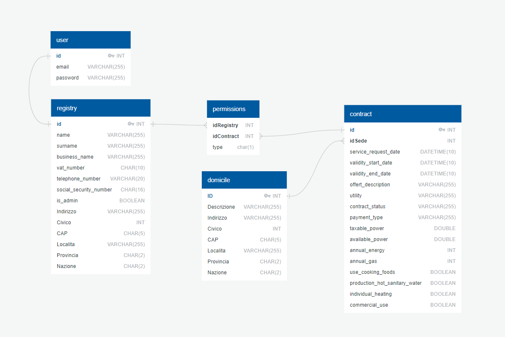

# Functions in database
### RegisterUser
```
SELECT RegisterUser(email,password)
```
this function will insert a new record to user, automatically gets user id, create a salt and hashes the password


[](https://app.quickdatabasediagrams.com/#/d/md79Su)


if it throws these errors:
```ERROR 2002 (HY000): Can't connect to local MySQL server through socket '/var/lib/mysql/mysql.sock' (111)```
```ERROR 2013 (HY000): Lost connection to MySQL server at 'reading initial communication packet', system error: 0```
wher running mysql use the flag ```protocol=tcp```
